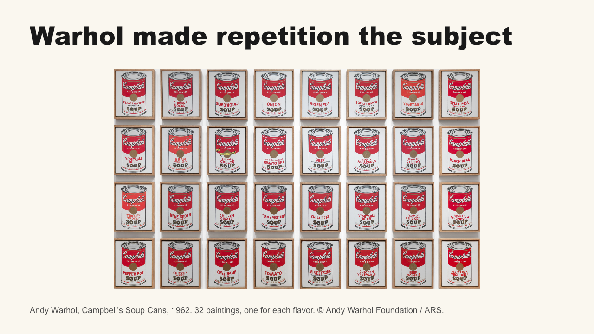
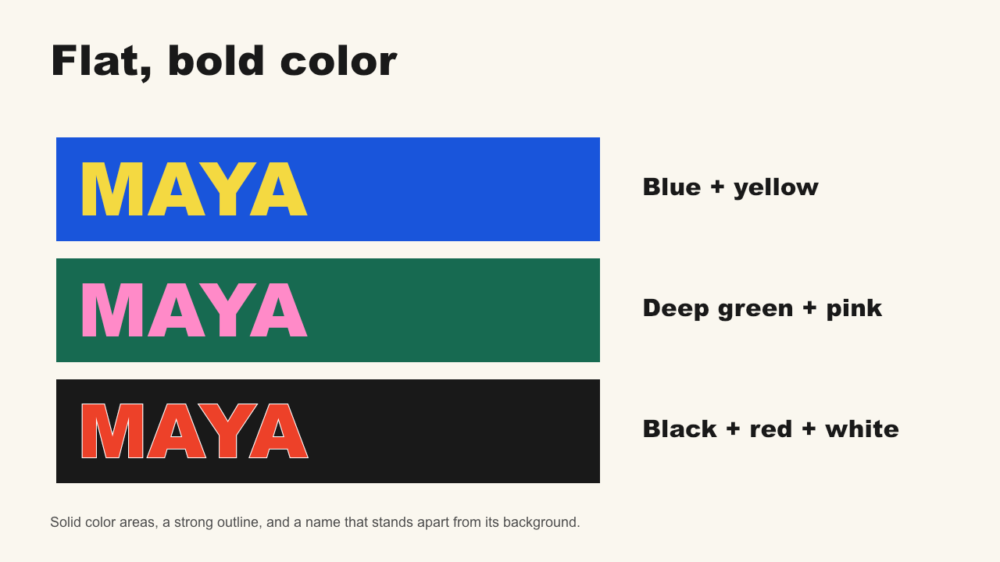
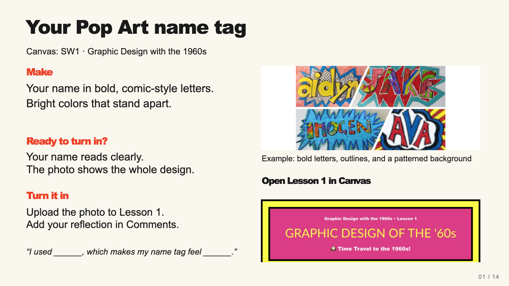
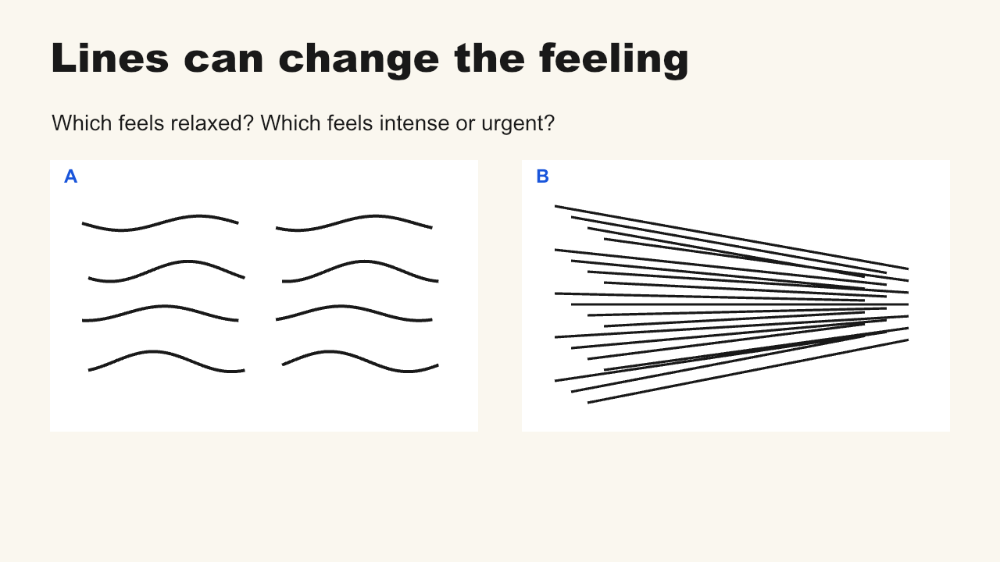
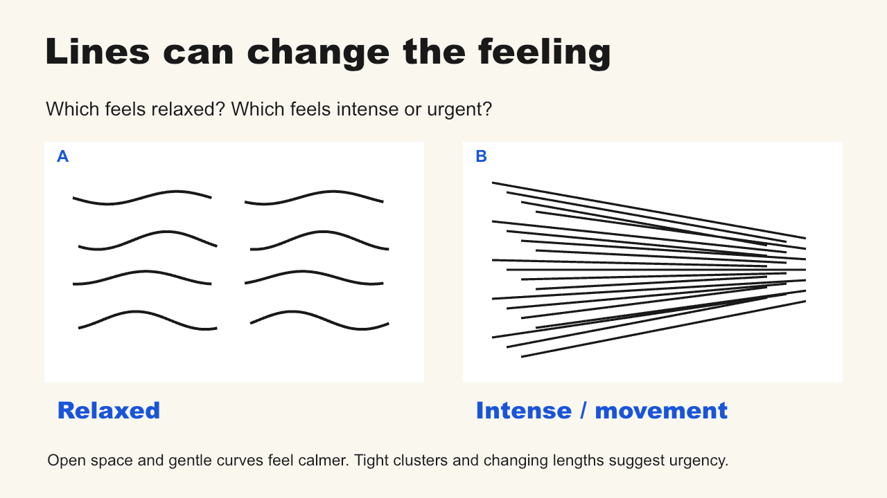
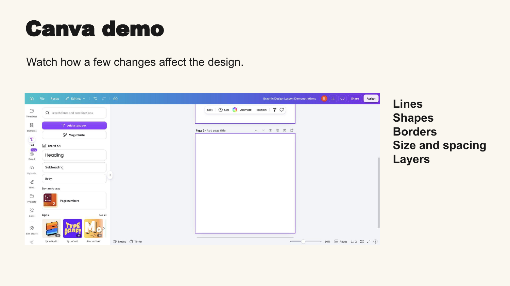
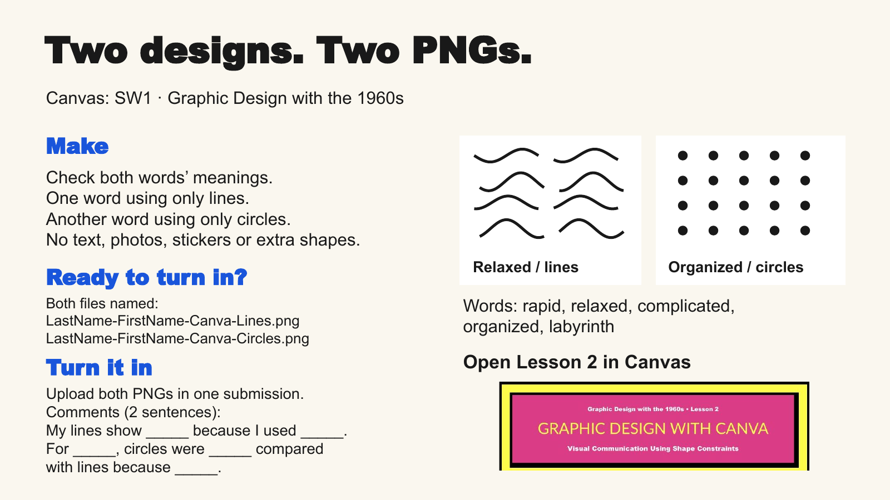

# Approved teaching exemplars: Graphic Design Lessons 1 and 2

Elisha designated these revised decks as project exemplars on September 9,
2026. Start with the [authoring standard](../../SLIDE_AUTHORING_STANDARD.md)
and [retrospective](../../retrospectives/graphic-design-lessons-1-and-2.md).
Study the teaching moves as well as the visual hierarchy. A preview is a
reading aid; the PowerPoint's speaker notes and live reveal behavior are part
of the exemplar.

## Exact versions

| Exemplar | Local PowerPoint | Native Google Slides | Companion guide |
| --- | --- | --- | --- |
| Lesson 1: Pop Art, approved 17-slide revision | [Approved smaller release](../../../assets/canvas/3289733-01-Pop-Art-Teaching-Deck.pptx) | [Make a copy](https://docs.google.com/presentation/d/1TeWTholt9fl-ahCVBv0U3Q9vdA9P9RbwpLt-9xZE9Ew/copy) | [Facilitator guide](../../../lessons/2657926.html) |
| Lesson 2: Graphic Design with Canva, approved 10-slide live-teaching revision | [Approved release](../../../assets/canvas/3289914-02-Canva-Live-Teach-Release.pptx) | [Make a copy](https://docs.google.com/presentation/d/1fKliAgkKHJLMD1BSTK-X0JRAp5CIRBGQq7h2R8lnpUY/copy) | [Facilitator guide](../../../lessons/2657927.html), [Google Doc copy](https://docs.google.com/document/d/1yL29WdZS1lzmRfR6S_x65GnHrSptJDHRb62h8YioTrs/copy) |

Google copies use the existing school-account permissions. The local files
provide an inspectable reference without Google sign-in. The [manifest](manifest.json)
pins full package hashes, slide counts, preview hashes, and Lesson 1's
protected slide parts. The September 9 historical versions are recoverable at commit
`e895d4dbf3bb99d865a723c5f3ba4ac444413021`. The current Lesson 2 version is
identified by its SHA-256 and [September 10 release record](../../reviews/lesson2-direct-image-submission-2026-09-10.md).

If a future source release changes a filename or Canvas ID, use the manifest
and the pinned Git revision or path history to recover the approved exemplar. Do not select
a different file solely because its title says “revised” or its timestamp is
newer. Update these pins only when the owner designates a replacement exemplar.
The September 9 Lesson 1 storage optimization changed encoding/duplicates,
not the approved teaching sequence or protected work slide.

## Lesson 1: evidence, explanation, then application

| Slide | Teaching job | What to learn from it |
| --- | --- | --- |
| 1. Pop Art of the 60s | Establish subject and central provocation | A clear identity and recognizable artwork can provide visual energy without a dense collage |
| 2. As you enter | Museum-object opening and sentence stem | One purposeful opening discussion connects the history to students' lives |
| 3. An argument about “serious” art | Explain the challenge to fine-art prestige | Concrete imagery and sourced notes support the provocation |
| 4. Warhol made repetition the subject | Show the soup-can series | The actual artwork, large enough to inspect, is the evidence |
| 5. The same package, unexpected color | Compare familiar and changed label colors | Distinguish works/dates and show the color change rather than merely naming it |
| 6. A famous face, repeated 50 times | Extend repetition beyond soup cans | A second kind of subject deepens the concept |
| 7. Roy Lichtenstein brought comics into Pop | Identify artist, work, and comic source | Credit adaptation accurately; show an actual comic-derived painting |
| 8. The comic look | Identify outlines, flat color, bubbles, dots | Every listed feature can be located in the image |
| 9. Pop's visual language could protest | Show a direct political print | An actual example carries the claim; do not assign its intention to all Pop Art |
| 10. Artists fought to be seen | Explain museum representation protests | Notes distinguish access/recognition from artistic ability and from a single art style |
| 11. Pop Art history | Optional video recap | Its role follows concepts already taught; it is not necessary to understand the deck |
| 12. Lettering changes the voice | Compare three renderings of one name | Same content, visibly different lettering, short useful descriptors |
| 13. Flat, bold color | Show three usable color pairings | Put the example beside its label |
| 14. Contrast makes the name readable | Compare readability | Preserve an effective contrast example rather than replacing everything |
| 15. Small dots, strong outlines | Connect detail to the name-tag task | A visual detail becomes a practical design choice |
| 16. A first sketch | Model a manageable starting sequence | Make the name readable before elaborating the background |
| 17. Your Pop Art name tag | Remain projected throughout work | Task, exemplar, done checks, reflection, and real Canvas cue stay together |

### Actual artwork as teaching evidence — slide 4

The teacher can point across the series. This replaces a distant museum view
and an unrelated repetition example. Artwork credit and full source notes
remain in the deck: Andy Warhol, Campbell's Soup Cans; MoMA reproduction;
© Andy Warhol Foundation / ARS. This preview carries the same credit; no new
open license is asserted.

### A concrete choice beside its explanation — slide 13

This is an original teaching diagram, not a claimed historical artwork. It
shows what “flat, bold color” means and gives the student usable possibilities.

### Protected work slide — slide 17

Keep this slide exactly as approved, including the image's existing footer.
The exemplar's title, screenshot, and student examples are not replaceable
decoration. The entire screen is a classroom tool that lets the teacher
circulate. Source-image credits and the recorded teacher-view screenshot
provenance are in the slide notes. This is an intentional raster preservation
exception within a deck whose revised instructional text is editable.

## Lesson 2: review, compare, reveal, demonstrate, work

| Slide | Teacher and student action | What to learn from it |
| --- | --- | --- |
| 1. Pop Art review | Students briefly recall two features on a notecard | Start with relevant previous learning, not project-word definitions |
| 2. Pop Art choices | Teacher points to five visual examples | Recall is supported by recognizable evidence |
| 3. Good design speaks without words | Introduce size, spacing, repetition, direction, layering | Give students the conceptual purpose before asking them to apply it |
| 4. Size creates emphasis | Notice first, then reveal labels and explanation | A controlled size difference shows emphasis |
| 5. Spacing and alignment | Vote organized/chaotic, then reveal | Acknowledge both gaps and alignment as changing cues |
| 6. Lines can change the feeling | Choose relaxed/intense, reveal, point to evidence | Curvature, gaps, clusters, and lengths work together |
| 7. Repetition and direction | Trace the eye's path, then reveal | Repeated marks and their placement are related but distinct choices |
| 8. Layering creates depth | Identify the overlapping edge, then reveal | Explain front/back order with ordinary shapes |
| 9. Canva demo | Switch to the real app for one short model | The projected slide orients; the guide supplies the detailed checklist |
| 10. Two designs. Two PNGs. | Explain word choices and work; leave the slide up | Both examples, constraints, filenames, comment stems, and Canvas route remain available |

### Guess before labels — slide 6

### Reveal, then explain the cues — slide 6 after one click

These are local initial/revealed render snapshots of the approved composition,
not screenshots proving native playback. The [release review](../../reviews/lesson2-live-teach-revision-2026-09-09.md)
separately records actual Google Slideshow playback checks. Native PowerPoint
playback was not claimed. A student may read a different feeling and support
it with a visible cue; the reveal teaches an intended reading, not emotional
right/wrong grading.

### One live-demo transition — slide 9

The screenshot is an authentic orientation cue. It happens to show the Text
sidebar; it is not a step-by-step claim that this is where students add lines,
and it is not permission to use text in the two graphics. The teacher switches
to the app and follows the guide's verified, object-specific checklist. New
tool tutorials must capture their own relevant controls rather than treating
this dated screenshot as universal UI evidence.

### One complete work-time screen — slide 10

The two graphics are uploaded as separate, named PNGs in one Canvas submission.
Two reflection sentences are saved in the submission comments. The worksheet
is an optional teacher-selected alternative only. This September 10 owner
correction supersedes the prior worksheet route while preserving the teaching
sequence and work-slide layout.
The source work examples are possibilities rather than designs every student
must copy. These two final screenshots are from the actual Google Slides PDF
export used in release review, with its normal rendering/font differences.

## Applying the exemplars to another unit

Read the full relevant deck and its notes. Identify the teaching move you are
borrowing and explain why it fits the new lesson. Reuse the clean hierarchy,
evidence-driven examples, comparison timing, executable demo, and persistent
work screen. Adapt the subject matter, task constraints, tools, and visuals to
the actual course source. Do not copy the Pop Art story or two-graphic task
into unrelated units, flatten new editable content, or turn every lesson into
the same beige slide layout.

The old 14-slide Pop Art and 17-slide Canva decks under the initial `output/review`
folder are before-state material. Other retained Lucero source decks preserve
teaching intent but are not these approved redesigned exemplars. The source
materials and screenshots supplied during feedback remain useful evidence;
their text is not an instruction to discard this standard or change scope.
